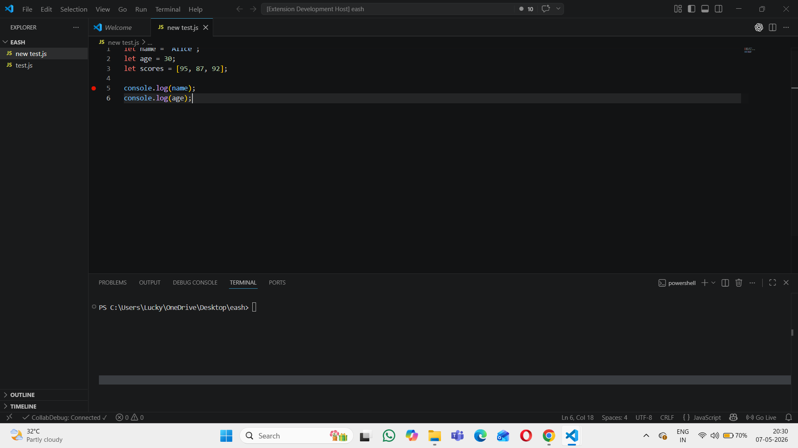
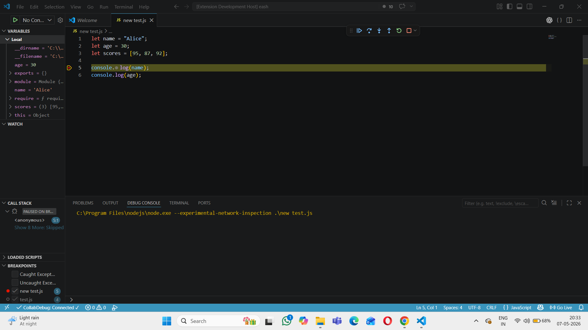

# Collab Debug

A real-time collaborative debugging extension for Visual Studio Code that enables multiple developers to share debugging sessions, synchronize breakpoints, and capture variable states during runtime.

---

# Features

## Real-Time Breakpoint Sync
- Detects breakpoint add/remove events
- Sends breakpoint updates through WebSocket
- Supports collaborative debugging workflows

## Variable State Capture
- Captures local variables when debugger pauses
- Sends variable states to connected users
- Helps remote developers inspect runtime data

## WebSocket Communication
- Real-time communication between extension and server
- Lightweight collaborative session handling

## Multi-User Collaboration
- Shared debugging environment
- Live event synchronization
- Session-based debugging support

---

# Tech Stack

- TypeScript
- Node.js
- VS Code Extension API
- WebSockets (`ws`)
- JavaScript Debug Adapter Protocol

---

# Project Structure

```bash
collab-debug/
│
├── src/
│   ├── extension.ts
│   ├── wsClient.ts
│   ├── server.js
│
├── screenshots/
│
├── package.json
├── tsconfig.json
├── README.md
```

---

# Installation

## Install using VSIX

1. Open Visual Studio Code
2. Go to Extensions
3. Click the three dots (...) at top-right
4. Select:
   ```bash
   Install from VSIX
   ```
5. Choose:
   ```bash
   collab-debug-1.0.0.vsix
   ```

---

# Running the Project

## Step 1: Install Dependencies

Open terminal inside project folder:

```bash
npm install
```

---

## Step 2: Start WebSocket Server

Run:

```bash
node src/server.js
```

Expected output:

```bash
✅ WebSocket server running on ws://localhost:3000
```

---

## Step 3: Launch Extension

Press:

```bash
F5
```

This opens:
```bash
Extension Development Host
```

---

# How to Use

## Breakpoint Synchronization

1. Open any `.js` or `.py` file
2. Click beside line number to add breakpoint
3. Breakpoint event is sent to server
4. Server logs breakpoint activity

Example output:

```json
{
  "type": "breakpoint",
  "action": "add",
  "file": "test.js",
  "line": 4
}
```

---

## Variable State Capture

1. Start debugging
2. Execution pauses on breakpoint
3. Extension captures local variables
4. Variable state is sent to server

Example output:

```json
{
  "type": "variable-state",
  "variables": [
    {
      "name": "a",
      "value": "10"
    },
    {
      "name": "b",
      "value": "20"
    }
  ]
}
```

---

# Commands

| Command | Description |
|---|---|
| Connect Session | Connects extension to collaboration server |
| Share Breakpoints | Synchronizes breakpoint events |
| Capture Variables | Sends variable state on debugger pause |

---

# Screenshots

## Breakpoint Synchronization

Add screenshot here:

```md

```

---

## Variable State Capture

Add screenshot here:

```md

```

---

# WebSocket Events

## Breakpoint Add

```json
{
  "type": "breakpoint",
  "action": "add"
}
```

## Breakpoint Remove

```json
{
  "type": "breakpoint",
  "action": "remove"
}
```

## Variable State

```json
{
  "type": "variable-state"
}
```

---

# Future Improvements

- Live breakpoint rendering for all users
- Shared call stack visualization
- Real-time console synchronization
- Remote session joining
- Authentication support
- Session persistence

---

# Repository

Repository URL:

```bash
https://github.com/collab-and-debug/debugger-extension
```

---

# Author

Eashwar Polishetti

GitHub:
```bash
https://github.com/eashwarpolishetti
```

---

# License

MIT License

---

# Release

Current Version:
```bash
v1.0
```

VSIX package available in GitHub Releases.